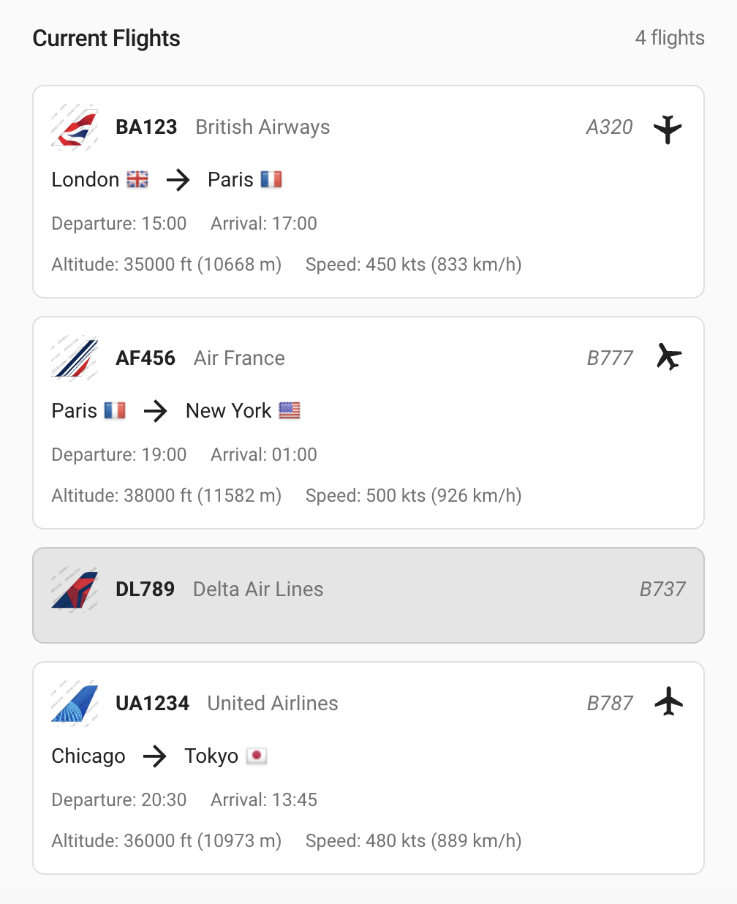
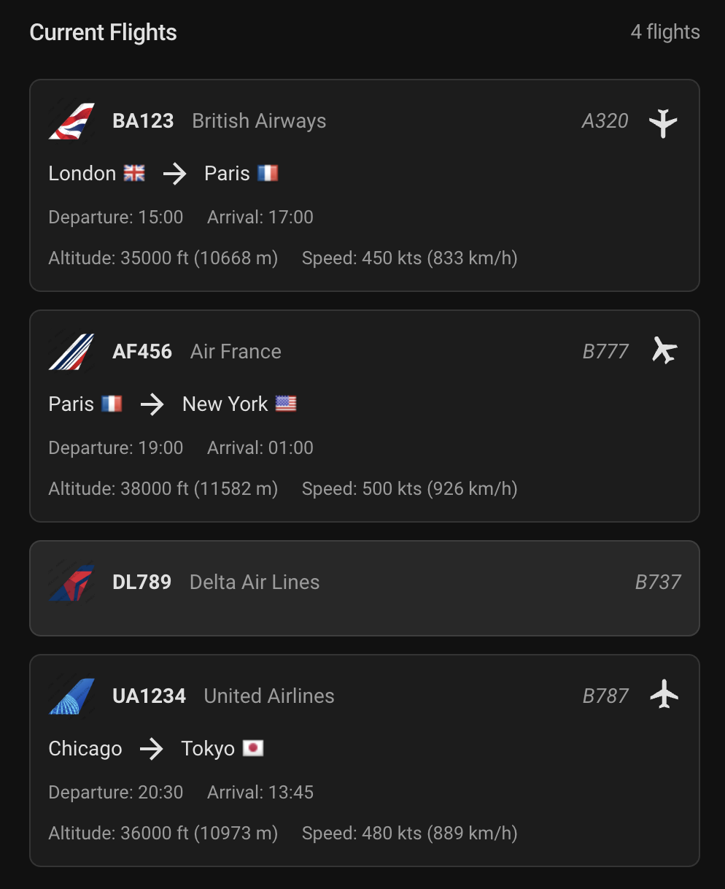

# Flight card

<table>
  <tr>
    <td></td>
    <td></td>
  </tr>
</table>

## Description

A flight card allows you to display and monitor flight information from various sources. It supports both live and historical flight data, showing details such as flight number, airline, aircraft, route, schedule, and real-time metrics.

## Configuration variables

All the options are available in the lovelace editor but you can use `yaml` if you want.

| Name                | Type    | Default | Description                                                                         |
| :------------------ | :------ | :------ | :---------------------------------------------------------------------------------- |
| `entity`           | string  | Required| Entity that provides flight data (e.g. sensor.flightradar24_current_in_area)        |
| `name`             | string  | Optional| Custom name for the card                                                            |
| `max_flights`      | number  | 5       | Maximum number of flights to show before displaying a "Show More" button            |

## Flight Data Structure

The card expects flight data in the following format:

```json
{
  "flight_number": "BA123",
  "callsign": "SPEEDBIRD123",
  "airline": "British Airways",
  "airline_short": "BA",
  "airline_icao": "BAW",
  "aircraft_model": "A320",
  "airport_origin_city": "London",
  "airport_origin_country_code": "GB",
  "airport_destination_city": "Paris",
  "airport_destination_country_code": "FR",
  "time_scheduled_departure": "2024-04-19T10:00:00Z",
  "time_scheduled_arrival": "2024-04-19T12:00:00Z",
  "altitude": 35000,
  "ground_speed": 450,
  "tracked_type": "live",
  "latitude": 50.1109,
  "longitude": 1.1848,
  "heading": 135
}
```

### Data Fields

| Field | Type | Description |
| :---- | :--- | :---------- |
| `flight_number` | string | Required. The flight number (e.g. "BA123") |
| `callsign` | string | Optional. The flight's callsign |
| `airline` | string | Optional. Full airline name |
| `airline_short` | string | Optional. Short airline name |
| `airline_icao` | string | Optional. ICAO airline code |
| `aircraft_model` | string | Optional. Aircraft model |
| `airport_origin_city` | string | Optional. Origin city |
| `airport_origin_country_code` | string | Optional. Origin country code (ISO 3166-1 alpha-2) |
| `airport_destination_city` | string | Optional. Destination city |
| `airport_destination_country_code` | string | Optional. Destination country code (ISO 3166-1 alpha-2) |
| `time_scheduled_departure` | string | Optional. Scheduled departure time (ISO 8601) |
| `time_scheduled_arrival` | string | Optional. Scheduled arrival time (ISO 8601) |
| `altitude` | number | Optional. Current altitude in feet |
| `ground_speed` | number | Optional. Current ground speed in knots |
| `tracked_type` | string | Required. Either "live" or "historical" |
| `latitude` | number | Optional. Current latitude |
| `longitude` | number | Optional. Current longitude |
| `heading` | number | Optional. Current heading in degrees |

## Features

- Displays flight information in a clean, organized layout
- Shows airline logos when available
- Displays country flags for origin and destination
- Shows real-time metrics for live flights (altitude, speed)
- Visual heading indicator for live flights
- Supports both live and historical flight data
- Responsive design that works well in different layouts
- Light and dark theme support

## Example Configuration

```yaml
type: custom:flight-card
entity: sensor.flightradar24_current_in_area
name: "Current Flights"
max_flights: 5
```

## Troubleshooting

If the card is not displaying any flights:

1. Check that your entity is providing data in the correct format
2. Verify that the `flights` attribute contains valid JSON
3. Ensure that at least the required fields (`flight_number` and `tracked_type`) are present
4. Check the browser console for any error messages 