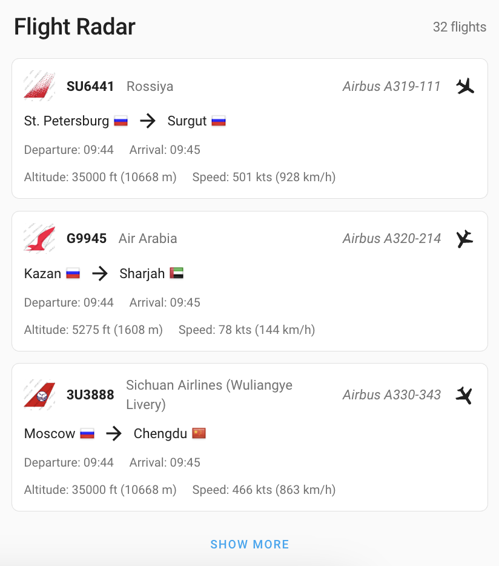
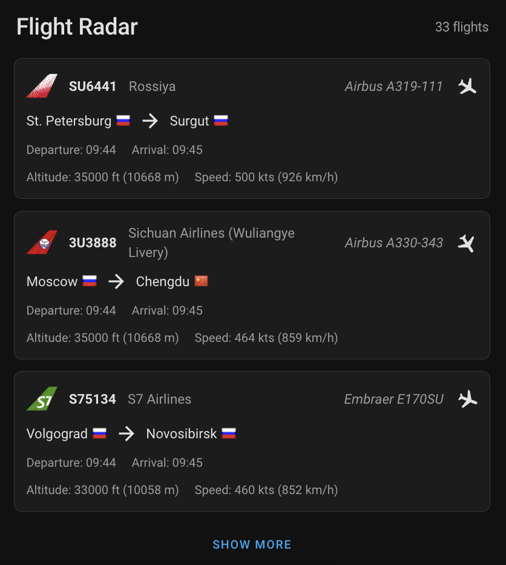

# Flight List Card

<table>
  <tr>
    <td></td>
    <td></td>
  </tr>
</table>

## Description

The Flight List Card displays real-time flight information in a clean, organized layout. It works with the [Flightradar24 Integration](data-sources.md#flightradar24-integration) to show flights in your area, including details like flight numbers, airlines, routes, and real-time metrics.

## Features

- 🛫 Real-time flight tracking
- ✈️ Airline logos and country flags
- 📊 Live metrics (altitude, speed, heading)
- 🌓 Light and dark theme support
- 📱 Responsive design
- ⚙️ Customizable display options

## Configuration

### Basic Setup

1. Install the [Flightradar24 Integration](data-sources.md#flightradar24-integration)
2. Add the card to your dashboard:
   - Click the three dots menu in your dashboard
   - Select "Edit Dashboard"
   - Click the "+" button to add a new card
   - Search for "Flight List Card"

### Options

| Option | Type | Default | Description |
| :----- | :--- | :------ | :---------- |
| `entity` | string | Required | The sensor entity that provides flight data (e.g. `sensor.flightradar24_current_in_area`) |
| `name` | string | Optional | Custom name for the card |
| `max_flights` | number | 5 | Maximum number of flights to show before displaying "Show More" |
| `display_fields` | array | All fields | Choose which information to display (see below) |
| `show_header` | boolean | true | Show/hide the card header |

### Display Fields

You can customize which information to show for each flight:

| Field | Description |
| :---- | :---------- |
| `departure_arrival_time` | Show departure and arrival times |
| `altitude` | Show current altitude |
| `speed` | Show current ground speed |
| `heading_icon` | Show heading indicator for live flights |
| `aircraft_model` | Show aircraft model |

## Examples

### Basic Configuration
```yaml
type: custom:flight-tracker-list-card
entity: sensor.flightradar24_current_in_area
name: "Current Flights"
```

### Custom Display
```yaml
type: custom:flight-tracker-list-card
entity: sensor.flightradar24_current_in_area
name: "Current Flights"
max_flights: 5
display_fields:
  - departure_arrival_time
  - aircraft_model
  - heading_icon
```

### Minimal Display
```yaml
type: custom:flight-tracker-list-card
entity: sensor.flightradar24_current_in_area
name: "Current Flights"
display_fields: []  # Shows only basic flight info
```

## Troubleshooting

If flights aren't showing up:

1. Make sure the Flightradar24 integration is properly installed and configured
2. Check that your entity is providing data
3. Verify the entity name is correct
4. Check the browser console for any error messages 